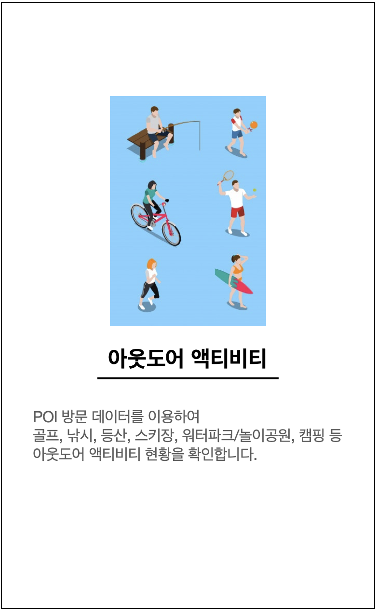
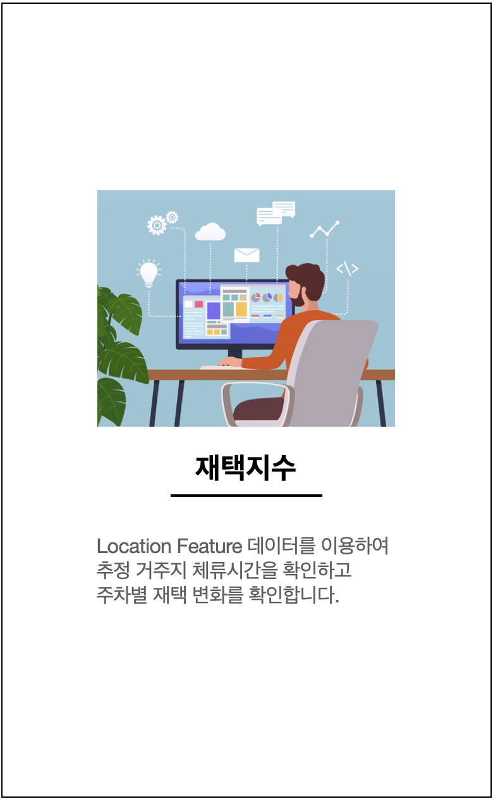
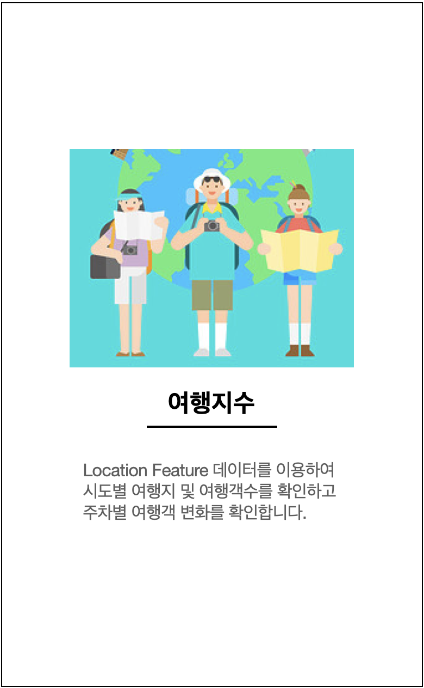

<style>
  .navbar {
    background-color:black;
    border-color:black;
  }
  .navbar-brand {
  color:white!important;
  }
  .section.sidebar{
  top: 51px;
  background-color:rgb(60, 60, 60);
  color:white!important;
  }
  .body {


  background-color:rgb(0,0,0);

  .search-button { width: 50px; height: 50px; line-height: 50px; }
  
  html,body        {height:100%;}
  .wrapper         {width:80%;height:100%;margin:0 auto;background:#CCC}
  .h_iframe        {position:relative;}
  .h_iframe .ratio {display:block;width:100%;height:auto;}
  .h_iframe iframe {position:absolute;top:0;left:0;width:100%; height:100%;}

</style>


```{r setup, include=FALSE}
# devtools::install_github("dmurdoch/leaflet@crosstalk4")
# devtools::install_github("jcheng5/d3scatter")
# library(leaflet.extras)

# library(leaflet)
library(tidyverse)
library(gapminder)
# library(countrycode)
# library(sf)
# library(rnaturalearth)
library(crosstalk)
library(leaflet)
library(DT)
library(rgdal)
library(maptools)
# library(proj4)
# library(d3scatter)
library(ggplot2)
library(plotly)
library(data.table)

# Code to create ScotPHO's Shiny profile platform
# In this script include packages, functions, datasets and anyting that will be 
# used both by UI and server

############################.
##Packages ----
############################.
library(shiny)
library(shinyBS) #modals
library(shinythemes) # layouts for shiny
library(dplyr) # data manipulation
library(ggplot2) #data visualization
library (DT) # for data tables
library(leaflet) #javascript maps
library(plotly) #interactive graphs
library(shinyWidgets) # for extra widgets
library(tibble) # rownames to column in techdoc
library(shinyjs)
library(shinydashboard) #for valuebox on techdoc tab
library(sp)
library(lubridate) #for automated list of dates in welcome modal
library(shinycssloaders) #for loading icons, see line below
library(rmarkdown)
library(flextable) #for tech document table
library(webshot) #to download plotly charts
library(rintrojs) # for help intros
# As well as webshot phantomjs is needed l to download Plotly charts
# https://github.com/rstudio/shinyapps-package-dependencies/pull/180
if (is.null(suppressMessages(webshot:::find_phantom()))) {
  webshot::install_phantomjs()
}

###############################################.
## Functions ----
###############################################.  
# Selects the variables of interest and renames them so csv downloads are 
# more user friendly


#Download button for charts, just changing the icon
savechart_button <- function(outputId, label = "Save chart", class=NULL){
  tags$a(id = outputId, class = paste("btn btn-default shiny-download-link", class), 
         href = "", target = "_blank", download = NA, icon("image"), label)
}

#Function to wrap titles, so they show completely when saving plot in ggplot
title_wrapper <- function(x, ...) 
{
  paste(strwrap(x, ...), collapse = "\n")
}

#Function to create plot when no data available
plot_nodata <- function(height_plot = 450) {
  text_na <- list(x = 5, y = 5, text = "No data available" , size = 20,
                  xref = "x", yref = "y",  showarrow = FALSE)
  
  plot_ly(height = height_plot) %>%
    layout(annotations = text_na,
           #empty layout
           yaxis = list(showline = FALSE, showticklabels = FALSE, showgrid = FALSE, fixedrange=TRUE),
           xaxis = list(showline = FALSE, showticklabels = FALSE, showgrid = FALSE, fixedrange=TRUE),
           font = list(family = '"Helvetica Neue", Helvetica, Arial, sans-serif')) %>% 
    config( displayModeBar = FALSE) # taking out plotly logo and collaborate button
} 

#Function to create plot when no data available for ggplot visuals
plot_nodata_gg <- function() {
  ggplot()+
    xlab("No data available")+
    scale_x_discrete(position = "top")+
    theme(panel.background = element_blank(),
          axis.title.x=element_text(size=20, colour ='#555555'))
}


# UI for heatmap and snapshot plots
sum_ui <- function(title, plot_name) {
  tagList(
    h5(title, style="color: black; text-align: center; font-weight: bold;"),
    div(align = "center", withSpinner(plotlyOutput(plot_name, height = "auto")))
  ) }

# Indicator definition boxes for indicator definition tab
ind_def_box <- function(label, text_output) {
  div(class="definitionbox",
      p(paste(label), style="font-weight:bold; font-size: 16px; color: #2FA4E7;"),
      h5(style = "color: black", textOutput(text_output)))
}

#Creating big boxes for main tabs in the landing page (see ui for formatting css)
lp_main_box <- function(title_box, image_name, button_name, description) {
  div(class="landing-page-box",
      div(title_box, class = "landing-page-box-title"),
      div(description, class = "landing-page-box-description"),
      div(class = "landing-page-icon", style= paste0("background-image: url(", image_name, ".jpg);
          background-size: auto 80%; background-position: center; background-repeat: no-repeat; ")),
      actionButton(button_name, NULL, class="landing-page-button")
      )
}


#Creating small boxes for further information in the landing page (see ui for formatting css)
lp_about_box <- function(title_box, image_name, button_name, description) {

  div(class="landing-page-box-about",
      div(title_box, class = "landing-page-box-title"),
      div(class = "landing-page-about-icon", style= paste0("background-image: url(", image_name, ".png);
          background-size: auto 80%; background-position: center; background-repeat: no-repeat; ")),
          (actionButton(button_name, NULL,
                   class="landing-page-button",
                   icon = icon("arrow-circle-right", "icon-lp"),title=description)))
}


###############################################.
## Palettes ----
###############################################.   
#Palette for SIMD.
pal_simd_bar <- c('#abd9e9', '#74add1', '#4575b4', '#313695', '#022031')
pal_simd_trend <- c('#abd9e9', '#74add1', '#4575b4', '#313695', '#022031', '#FF0000')

#Palette for map
pal_map <- c('#2c7bb6','#abd9e9', '#ffffbf','#fdae61','#d7191c')

##########.
#Cookie warning
cookie_box <- div(class="alert alert-info", style = "margin-bottom: 0",
      "This website places cookies on your device to help us improve our service 
      to you. To find out more, see our ",
      tags$a(href='https://www.scotpho.org.uk/about-us/scotpho-website-policies-and-statements/privacy-and-cookies',
  " Privacy and Cookies"), "statement.",
      HTML('<a href="#" class="close" data-dismiss="alert" aria-label="close">&check;</a>'))

# Identify which geographies have data for each indicator
# indic <- unique(optdata$indicator[!is.na(optdata$measure)])
# indic_geog <- tapply(optdata$areatype[!is.na(optdata$measure)], optdata$indicator[!is.na(optdata$measure)], unique)

##END


```

HOME {data-icon="fa"}
=====================================
<center>
  
</center>

<p></p>
Column
------------------------------------------------------

<center>

[{height="700px" width="450px" border="1px solid black"}](#outdoor-activities)

</center>

Column
------------------------------------------------------

<center>

[{height="700px" width="450px" border="1px solid black"}](#stay-home)

</center>

Column
------------------------------------------------------

<center>

[{height="700px" width="450px" border="1px solid black"}](#travel)

</center>

Outdoor Activities {data-icon="fa-sun"}
===================================== 

 
Column{data-width=900}
------------------------------------------------------
 
### 


<iframe style="left:0; top:0; width:100%; height:100%" src="https://skt-pnb-share.github.io/index_shan"></iframe>


Column{data-width=300}
------------------------------------------------------
###  
2020년 C-19 확산 이후, 캠핑의 인기가 급증한 것으로 확인되었고,
겨울철에는 스키장 방문 순위가 상승한 것으로 나타남.

Stay Home {data-icon="fa-home"}
=========================================================================================== 


 
Column{data-width=900}
------------------------------------------------------

### 


<iframe style="left:0; top:0; width:90%; height:90%" src="https://skt-pnb-share.github.io/index_ryu"></iframe>


 
Column{data-width=300}
------------------------------------------------------
###  
2020년 초 (상반기) 재택 경향이 크게 증가하였고,
2020년 여름/휴가 시즌을 거치며 비교적 완만한 회복세를 보이고 있음.
2021년 상반기 2차 대 확산 기를 거치며 재택 경향이 다소 증가하는 가운데, 균현을 찾아가는 중.
코로나 사태 장기화에 따라 다소 높은 수준의 재택 수준으로 안정화되고 있는 모습 확인.

Travel {data-icon="fa-suitcase-rolling"}
=========================================================================================== 


 
Column{data-width=900}
------------------------------------------------------
### 

<iframe style="left:0; top:0; width:90%; height:90%" src="https://skt-pnb-share.github.io/index_jh"></iframe>


 
Column{data-width=300}
------------------------------------------------------
###  
2020년 인천 지역 여행객이 크게 줄었으며, 이는 해외여행 (공항) 방문 감소를 의미.
특히 코로나 사태 이후, 국내 여행이 해외 여행 수요를 흡수하며, 국내 여행객수가 증가한 것으로 확인됨.

